# Job Search Board

A one-screen command center for a senior-level, network-driven job search, built and run with [Claude Code](https://claude.com/claude-code). Every morning it collects new postings from alert mail, reads each one against a rubric the owner keeps correcting, and puts the survivors on a hosted page. The owner's verdicts, pipeline moves, people and to-dos flow back into one record that every other view is generated from.

**[Open the live demo](https://mfuchs22.github.io/job-search-board/)**: the real page, running on invented data, no sign-in. Click around; verdicts and stage moves work and are forgotten when you reload.

[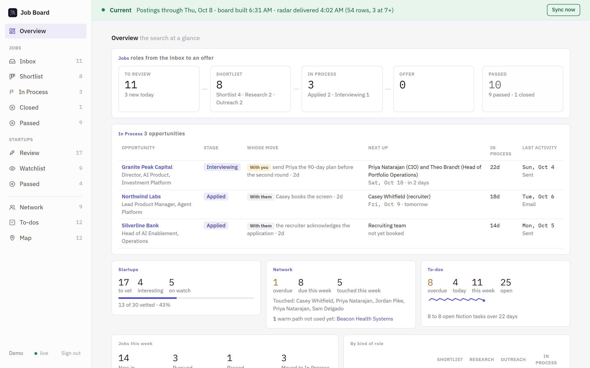](https://mfuchs22.github.io/job-search-board/)

## What it does

The board is a funnel. Postings arrive in the **Inbox** after an overnight read; each gets a verdict (Pursue, Maybe, Pass), a calibration of the score, and a note. Pursues land on the **Shortlist** in three columns by kind of role and move through research and outreach. Once an application is in, the role moves to **In Process**, where each opportunity has its own page: who is next, what to get across, what to ask, the timeline, the people, the prep and every document sent. **Closed** and **Passed** keep the audit trail. Alongside the jobs track, a **Startups** track screens a city's startup scene, a **Network** tab runs the people (who to touch, when, why), **To-dos** gathers every next step in one agenda, and a **Map** shows where the roles and the startups actually sit.

The rubric is a living document. Every verdict is logged against the score it corrected, and the rubric is revised in numbered versions from those logs. After the first fifty-odd verdicts the finding was that the point score barely discriminates above the floor; the gates (location, travel, role shape, company trajectory, hard requirements) do the real work, so the current rubric runs gates first and points second.

## How it works

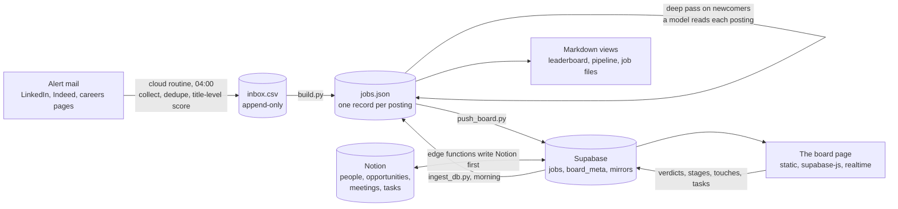

Four stages, kept deliberately apart:

- **Collect** is deterministic and cheap. A scheduled routine reads job-alert mail, canonicalizes URLs, dedupes, appends rows, and gives each a provisional title-level score with a one-line reason. It never edits anything else.
- **Store** is one JSON file with one writer. `build.py` ingests new rows, merges the same posting seen under several boards or locations, and regenerates every markdown view. Run it twice and the second run changes nothing.
- **Review** is the page in `web/`: static files, no build step, deployed anywhere. It reads ten tables from Supabase after sign-in and subscribes to realtime changes, so a phone and a laptop stay in step. Verdicts write straight to a table; stage moves, people and tasks go through three edge functions that write Notion first and mirror the result.
- **Pursue** closes the loop each morning: fold the verdicts back into the record, run the deep pass on newcomers that cleared the screen, rebuild, push, and post one report to a Discord channel. The reasoning work (outreach plans, prep, follow-ups) happens in a Claude Code session with the vault open.

Collection and dedupe are plumbing (a cron job, later an n8n flow). Scoring, deep passes, outreach plans and rubric revisions need a model reading text. Verdicts need a human. `docs/routines.md` lists every scheduled job and which of the three it is.

## The tabs

| | |
|---|---|
| **Inbox** · the morning review. A card per posting that cleared the screen: what the role is, what they ask for, the company and whether it is growing, who you know there, the rubric's arithmetic. Verdict, calibration, note, Enter, next card. [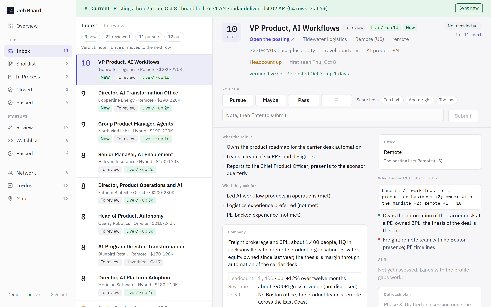](screenshots/inbox.png) | **Shortlist** · every Pursue not yet applied, in three columns by kind of role, tagged with its stage, days on the list and days in stage, amber when stale. Human-path tiles at the top say how many have a warm way in. [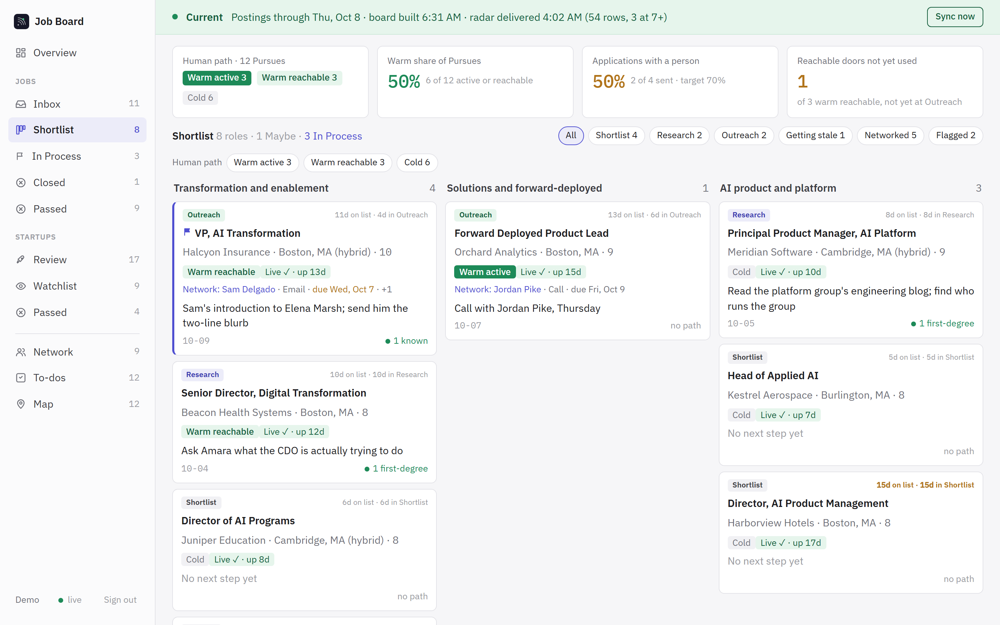](screenshots/shortlist.png) |
| **In Process** · one page per live opportunity: next up, whose move it is, what to get across, what to ask and avoid, what is settled and still open; tabs for the role, the timeline, the people, the prep and the library of everything sent. [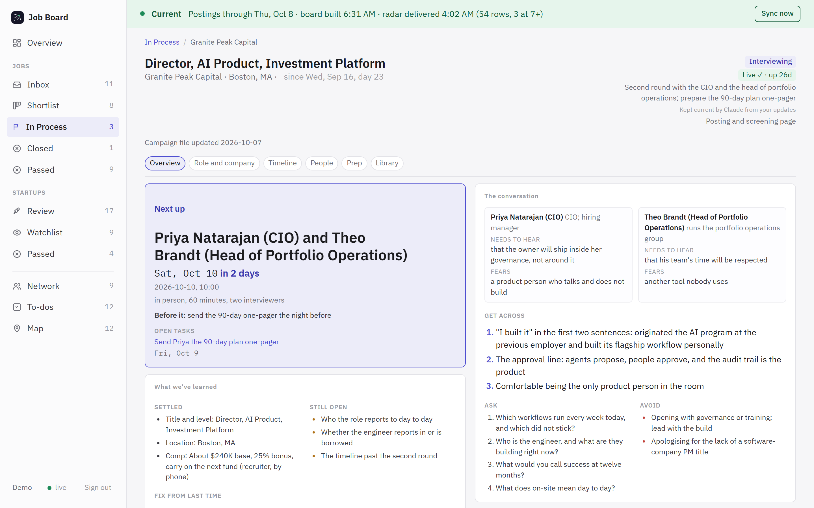](screenshots/in-process-role.png) | **Role detail** · everything the engine knows about one posting: the office on a map, why it scored, the human path, the posting's liveness, the company's growth read. [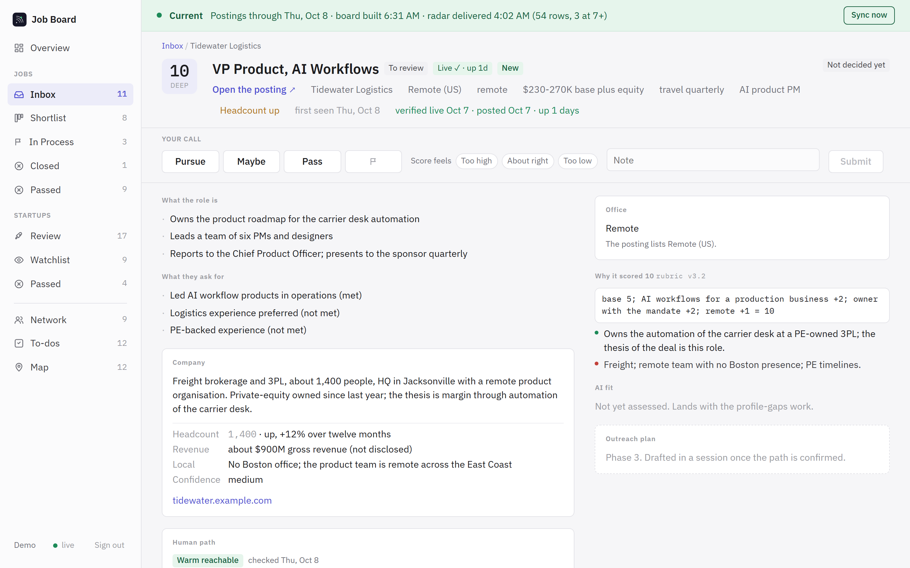](screenshots/role-detail.png) |
| **Startups** · a city's startup scene, pre-scored by a deterministic screen, reviewed one by one: Interesting, Watch or Pass. The Watchlist groups the kept ones into theses; a quick diligence pass fills each profile. [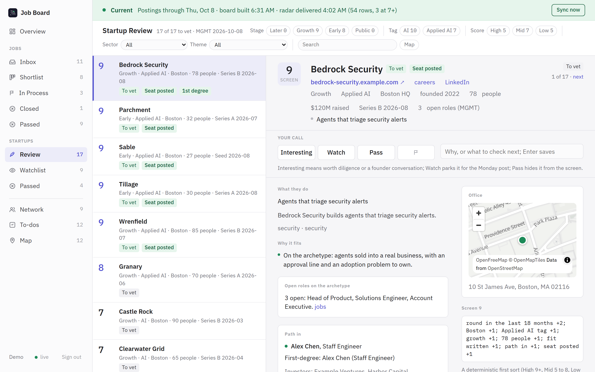](screenshots/startups-review.png) | **Network** · the people, with a next touch and a date each. Overdue, today and this week up top; the pane edits the next touch and logs the one just made. The home is a Notion database; edits here save there. [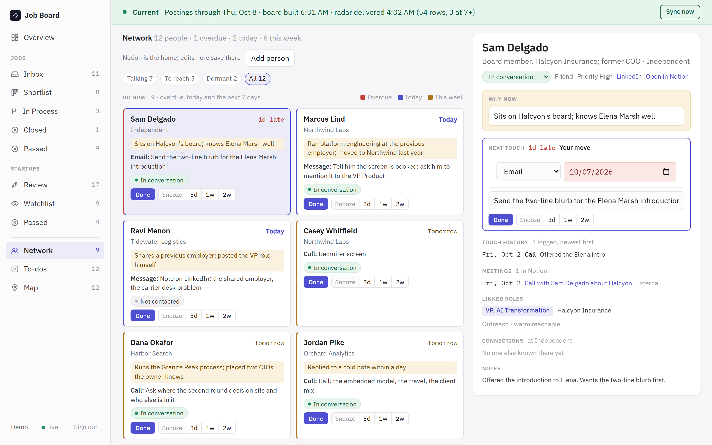](screenshots/network.png) |
| **To-dos** · one agenda over three homes: a role's next step, a person's next touch, a career task. Done, Today, Tomorrow, Next week, Later. Changes stage in the browser and sync in one batch. [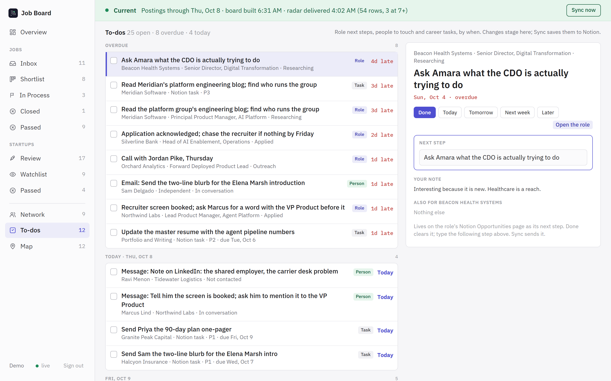](screenshots/todos.png) | **Map** · Pursue and Maybe roles at the office they hire into, and the startups called Interesting or Watch beneath them. Filters are the same chips as the lists. [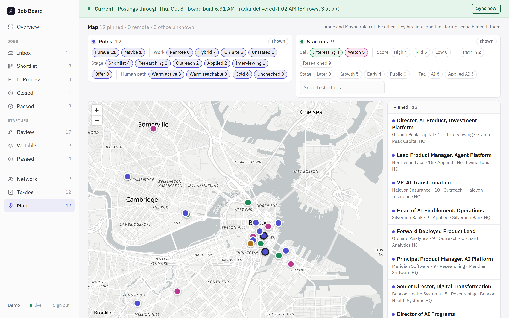](screenshots/map.png) |

Also: **Overview** (the funnel, the live opportunities, this week's flow, the split by kind of role), **Closed** (engaged and lost, or the ad went away), **Passed** (the rubric's training data), **Watchlist**, and a phone layout for the morning scan.

<p align="center">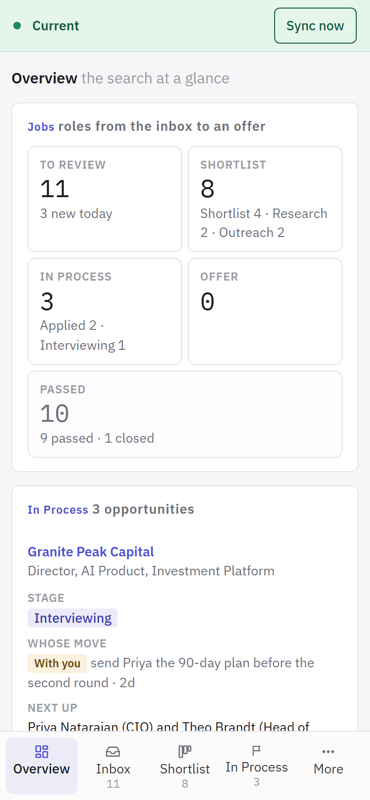 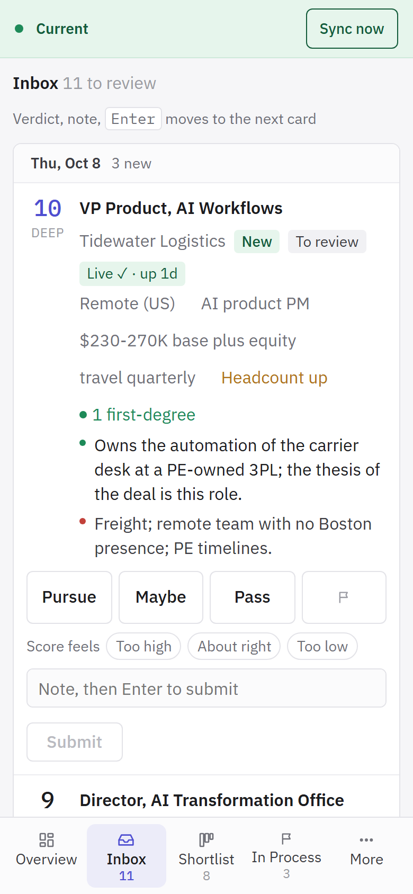 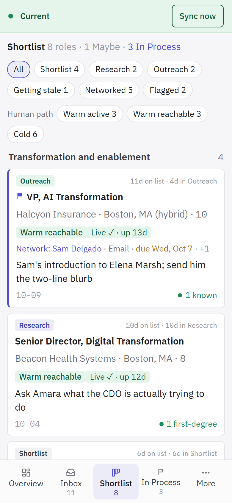 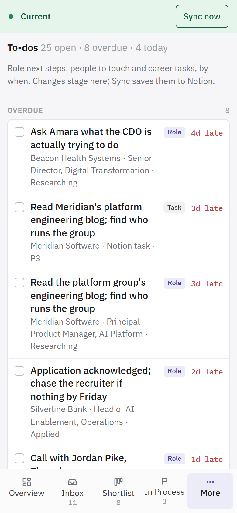</p>

## Layout

```
web/
  index.html            the board page (vanilla JS, supabase-js, realtime); startups.js the Startups tabs
  demo.js               demo mode: a stand-in for supabase-js that serves the page from demo/data.json
  demo/data.json        the invented dataset the demo runs on (py demo/make_demo.py rebuilds it)
  config.js             the demo config; config.example.js shows the live one
engine/
  common.py             config, vault paths, canonical URLs and ids, duplicate merge, jobs.json I/O
  build.py              the single writer: ingest inbox.csv, regenerate the views, push the board
  render_dashboard.py   jobs.json + companies.json + people.json + job markdown -> the board payload
  push_board.py         upsert the payload into Supabase
  ingest_db.py          fold the board's verdicts and stages back into jobs.json
  apply_deep_pass.py    fold deep-pass results (posting read, company, gates, score) into the record
  posting_check.py      nightly: is each ad still up (LinkedIn, Greenhouse, Lever, Ashby, Workday, employer pages)
  human_path.py         the warm-path gate: who you know at each company and whether you used it
  org_chart.py          a company's team page -> seniority tiers and departments, flagged against the vault
  network_ingest.py     LinkedIn connections export -> who do I know at each board company
  notion_sync.py        pull people, opportunities, meetings and tasks from Notion into the mirrors
  startups.py           a city's startup list -> screened, geocoded cards for the Startups tab
  calibrate.py          the weekly rubric calibration: tier table, window verdicts, regex backtests
  stage_history.py      when each role entered each stage; pulse_history.py the Overview's trend
  sync_worker.py        the board's Sync now button, served by an always-on worker
supabase/
  migrations/           schema: tables, row-level security, realtime publication
  functions/            opportunity-write, network-write, task-write (write Notion first, mirror after)
docs/
  schema.md             record shape, stage enum, database tables
  board-prd.md          what the page must do, and the walkthrough it came from
  deep-pass.md          the brief a session follows to turn a radar row into a card
  rubric-template.md    the rubric's shape with the owner's specifics removed
  routines.md           every scheduled job, when it runs and what it may touch
demo/
  make_demo.py          builds web/demo/data.json; screenshots.py renders every tab in headless Chromium
```

## Running it yourself

The demo needs nothing: open `web/index.html` from any static server (`py -m http.server 8742 --directory web`).

A real board needs a vault (a folder of markdown and JSON the engine reads and writes), a Supabase project, and somewhere to host `web/`. In short:

1. `py -m pip install -r requirements.txt`, copy `config.example.json` to `config.json`, point it at a vault folder with `jobs/`, `meta/`, `network/`, and add the Supabase URL and secret key.
2. Apply `supabase/migrations/*.sql`, seed `board_owners` with your email, create that user. Deploy the three edge functions if you want Notion as the home for people and opportunities; skip them and the page still runs on verdicts alone.
3. Copy `web/config.example.js` to `web/config.js` with the project URL and publishable key; deploy `web/` as a static site.
4. `py engine/build.py` regenerates the views and pushes the board. Each morning: `py engine/ingest_db.py`, the deep pass (`docs/deep-pass.md`), `py engine/build.py`.

**[BUILD-WITH-AI.md](BUILD-WITH-AI.md)** is the longer version, written for someone who wants to hand this repo to Claude Code (or any coding agent) and have it build their own board: what to read in which order, what to adapt, what to leave alone.

## Credits

Built by Matt Fuchs with Claude Code over September and October 2026 as the engine behind a real search; the design notes in the code carry the dates of the decisions. The data in the demo is invented: no company, person, posting or note in it is real. MIT licensed.
